## 2.1经验误差与过拟合：
### 概念：
* 错误率error rate:分类错误的样本数占样本总数的比例$E=a/m$，精度accuracy:$1-a/m$
* 误差:error:学习器的实际预测输出与样本的真实输出之间的差异(学习器在训练集上的误差——训练误差/经验误差，学习器在新样本上的误差——泛化误差)
* 过拟合(overfitting):学习器把训练样本学得太好了，很可能把训练样本自身的一些特点当作了所有潜在样本都会具有的一般性质，导致泛化性能下降
* 欠拟合(underfitting):对训练样本一般性质尚未学好
<u>过拟合是无法彻底避免的，只能缓解</u>
---
## 2.2评估方法：
基本概念：
通过实验测试对学习器的泛化误差进行评估并进而做出选择，为此需要一个测试集testing set,以测试集上的测试误差testing error作为泛化误差的近似,测试样本也是i.i.d得来，测试集应与训练集互斥
### 2.2.1留出法(hold out)：
直接将数据集D划分为两个互斥的集合，其中一个作为训练集S，另一个作为测试集T$D=S\cup T,S\cap T=\emptyset$

_训练/测试集的划分要尽可能保持数据分布的一致性_
分层采样(stratified sampling)：保留类别比例的采样方式

_单次使用留出法得到的结果往往不够稳定可靠，在使用留出法时，一般要采用若干次随机划分、重复进行实验评估后取平均值作为留出法的评估结果_

* 训练集S包含绝大多数样本，则训练出的模型可能更接近于用D训练出的模型，但T较小，评估结果可能不够稳定准确
* 若T包含多一些的样本，降低了评估结果的保真性fidelity，没有完美解决方案，通常将**2/3~4/5**的样本用于训练，剩余样本用于测试。
### 2.2.2交叉验证法：
#### 做法：
将数据集划分为k个大小相似的互斥子集，即$D=D_1\cup D_2\cup \cdots \cup D_k,D_i\cap D_j=\emptyset(i\neq j)$,每个子集尽可能保持数据分布的一致性，即从D中通过分层采样得到，每次用k-1个子集的并集作为训练集，余下的作为测试集;这样就可以获得k组训练/测试集，从而可以进行k组训练和测试，最终返回k个结果的均值。**交叉验证的稳定性和保真性很大程度上取决于k的取值，通常把交叉验证称为k折交叉验证(k-fold cross validation)** *k常用为10*
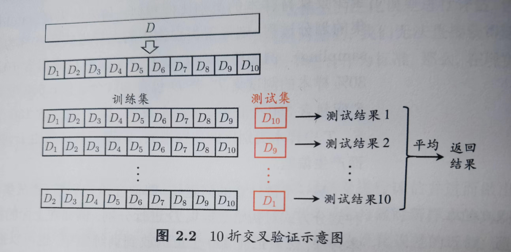

为减少因样本划分不同而引入的误差，k折交叉验证通常要随即使用不同的划分重复p次，最终结果是p次k折交叉验证结果的平均，*常见10次10折交叉验证*

#### 留一法：
假设数据集D包含m个样本，若令k=m，则得到交叉验证的一个特例：留一法(Leave-One-Out,简称LOO),留一法不受随机样本划分方式的影响，因为m个样本划分为m个子集只有一种方式。
留一法训练集与原始数据集相比只少了一个样本，使得留一法评估结果往往很准确，然而留一法在数据集较大时，训练m个模型的计算开销可能难以忍受，结果也未必准确
### 2.2.3自助法
#### 做法：
给定包含m个数据的数据集D，对它进行采样产生数据集D':每次随即从D中挑选一个样本，拷贝放入D',再放回D，使其下次采样时仍有可能被采到，重复m次，得到包含m个样本的数据集D'，D中一部分样本出现在D'一部分不出现，样本在m次采样过程中被采到的概率为$(1-\frac{1}{m})^m$，取极限为$\frac{1}{e}\approx0.368$
**即通过采样，仍有约36.8%的样本未出现在D'**
可将D'用作训练集，D\D'用作测试集
这样的测试结果，称为包外估计(out-of-bag-estimate)
#### 应用场景：
在数据集较小、难以有效划分训练\测试集的时候很有用
然而自助法产生的数据集改变了初始数据集的分布，会引起估计偏差。 
### 2.2.4 调参(parameter tuning)与最终模型：
#### 调参：
* 超参数：算法的参数，数目在10以内，人工设定
* 模型的参数：很多，通过学习产生候选模型
调参常用做法：对每个参数选定一个范围和变化步长
#### 最终模型：
给定含m个样本的数据集D，一部分训练，一部分测试，在模型选择后，学习算法和参数配置已选定，应用数据集D重新训练模型。

模型评估与选择中用于评估测试的数据集称为验证集(validation set)
例如：在研究对比不同算法的泛化性能时，用测试集的判别效果来估计模型在实际使用时的泛化能力，而把训练数据另外划分为训练集和验证集，基于验证集上的性能来进行模型选择与调参

---
## 2.3 性能度量(performance measure)：
概念：衡量模型泛化能力的评价标准,反映任务需求，使用不同的性能度量往往会导致不同的评判结果

样例集:$D=\{(x_1,y_1),(x_2,y_2),\cdots,(x_m,y_m)\}$,其中$y_i$是$x_i$的真实标记，评估f的性能，就是把f(x)与真实标记y比较

**均方误差(mean squared error)**：
$$E(f;D)=\frac{1}{m}\sum_{i=1}^m(f(x_i)-y_i)^2$$
更一般的：
$$E(f;D)=\int_{x\backsim D}(f(x)-y)^2p(x)dx\\x\backsim D:x在D分布下的数学期望\\
p:概率密度函数$$
### 2.3.1错误率和精度：
错误率：分类错误的样本数量栈样本总数的比例
精度：分类正确的样本占样本总数的比例
对样例集D:
分类错误率定义:
$$E(f;D)=\frac{1}{m}\sum_{i=1}^mⅡ(f(x_i)\neq y_i)$$
精度定义：
$$acc(f;D)=\frac{1}{m}\sum_{i=1}^{m}Ⅱ(f(x_i)=y_i)=1-E(f;D)$$
更一般的，对于数据分布D和概率密度函数p(·)
错误率：
$$E(f;D)=\int_{x\backsim D}Ⅱ(f(x)\neq y)p(x)dx$$
精度：
$$acc(f;D)=\int_{x\backsim D}Ⅱ(f(x)= y)p(x)dx=1-E(f;D)$$
### 2.3.2查准率、查全率和F1:
用训练好的模型挑好瓜
查准率(precision)/准确率:挑出来的瓜有多少是好瓜
查全率(recall)/召回率:好瓜中有多少被挑出来了

对于二分类问题：
划分为：真正例(true positive)*TP*、假正例(false positive)*FP*、真反例(true negative)*TN*、假反例(false negative)*FN*

TP+FP+TN+FN=样例总数
混淆矩阵(confusion matrix):  
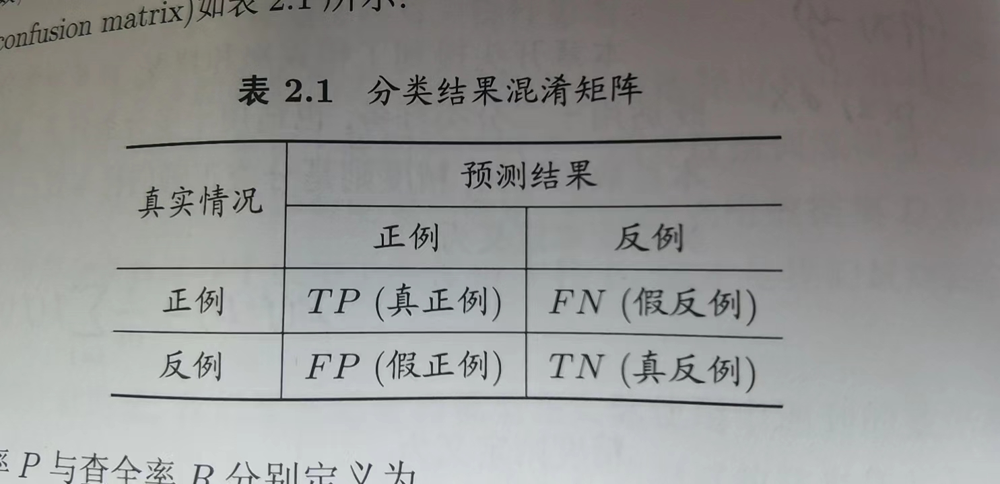

查准率P和查全率R定义：
$$P=\frac{TP}{TP+FP}$$ 
$$R=\frac{TP}{TP+FN}$$
一般查准率和查全率是矛盾的度量

P-R曲线：
根据学习器的预测结果对样例进行排序，排在最前面的是学习器认为最可能是正例的样本，按此顺序(*阈值由1降低*)逐个把样本作为正例进行预测，每次计算P,R，以R为横轴,P为纵轴绘制曲线
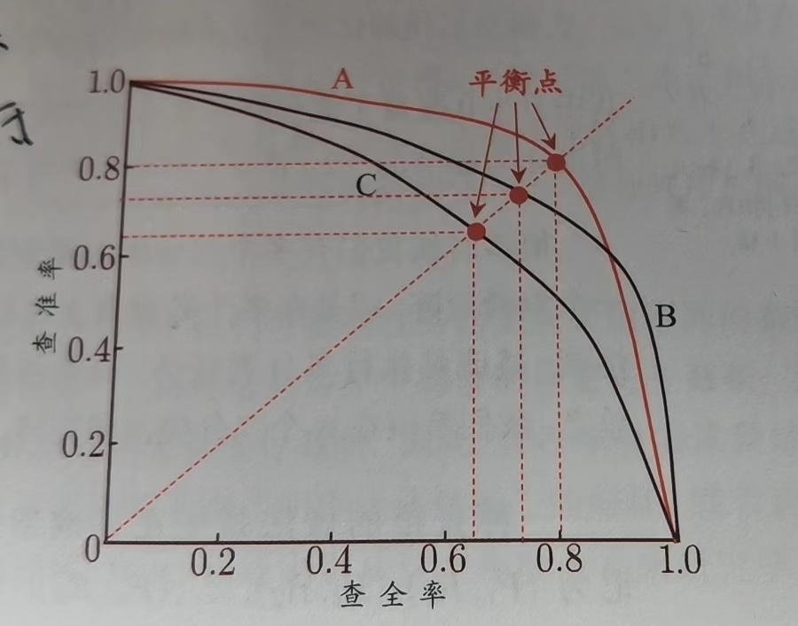
如果一条曲线被另一条曲线完全包住，则后者学习器的性能优于前者，有交叉一般比较面积

平衡点BEP：
查准率=查全率的时的取值

F1度量：
$$F1=\frac{2\times P\times R}{P+R}=\frac{2\times TP}{\text(样例总数)+TP-TN}$$
$F_\beta$表达对查准率查全率的不同偏好
$$F_\beta =\frac{(1+\beta^2)\times P\times R}{(\beta^2\times P)+R}$$
$\beta >1,查全率有更大影响,\beta<1，查准率有更大影响$

很多时候有多个混淆矩阵，例如多次训练测试，或在多个数据集上训练测试，希望在n个混淆矩阵上综合考察准确率和查全率
做法：计算$(P_1,R_1),(P_2,R_2)\cdots,(P_n,R_n)$平均值,得到宏查准率(macro-P),宏查全率(macro-R),宏F1(macro-F1)
$$macro-P=\frac{1}{n}\sum_{i=1}^nP_i$$
还可以将混淆矩阵对应元素进行平均，得到TP,FP,TN,FN的平均值，记为$\bar {TP},\bar {FP},\bar {TN}，\bar {FN}$
微查准率(micro-P)
$$micro-P=\frac{\bar TP}{\bar TP+\bar FP}$$

### 2.3.3 ROC与AUC
#### ROC:
纵轴：真正例率(True Positive Rate TPR)
横轴：假正例率(False Positive Rate FPR)
$$TPR=\frac{TP}{TP+FN}$$
$$FPR=\frac{FP}{TN+FP}$$
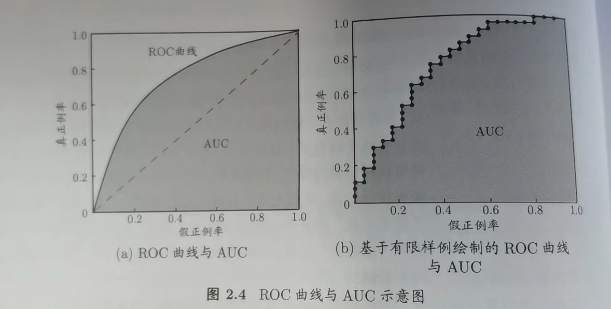
(0,1)是理想模型,对角线是随机猜测模型

学习器优劣判据：ROC曲线下的面积AUC

### 2.3.4代价敏感错误率与代价曲线：
为错误赋予非均等代价(unequal cost) 

二分类任务为例:
设定一个代价矩阵(cost matrix)
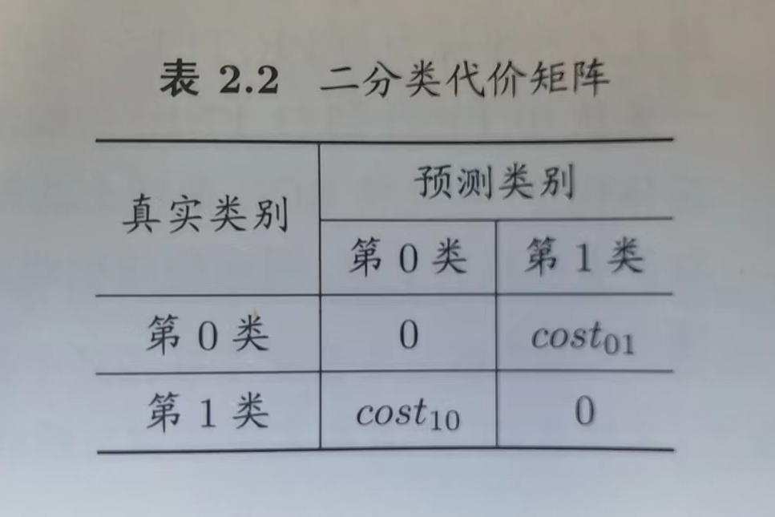
$cost_{ij}$是将第i类样本预测为第j类样本的代价

代价敏感cost-sensitive错误率：
$$E(f;D)=\frac{1}{m}(\sum_{x_i\in D^+}Ⅱ(f(x_i)\neq y_i)\times cost_{01}+\sum_{x_i\in D^-}Ⅱ(f(x_i)\neq y_i)\times cost_{10})$$

在非均等代价误差下，ROC曲线不能直接反映学习器的期望总体代价，代价曲线可以
横轴：正例概率代价:
$$P(+)cost=\frac{p\times cost_{01}}{p\times cost_{01}+(1-p)\times cost_{10}}$$
p是样例为正例的概率
纵轴:取值为[0,1]的归一化代价：
$$cost_{norm}=\frac{FNR\times p\times cost_{01}+FPR\times (1-p)\times cost_{10}}{p\times cost_{01}+(1-p)\times cost_{10}}$$
FNR=1-TPR假反例率
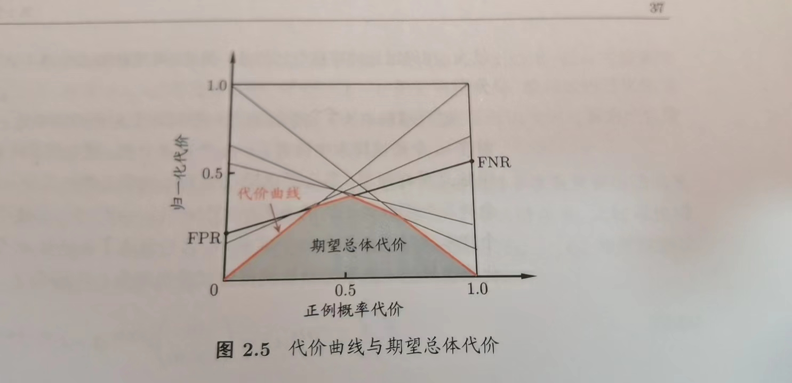

---

## 2.4比较检验：
对学习器的性能进行评估：先试用某种实验评估方法测得学习器的某个性能度量结果，然后对这些结果进行比较。

统计假设检验(hypothesis test)为我们进行学习器性能的比较提供了重要依据，基于假设结果，我们可以推断：若在测试集上观测到学习器A比B好，则A的泛化性能是否在统计意义上优于B，以及这个把握有多大，默认以错误率$\epsilon$为度量方法

### 2.4.1假设检验：
‘假设’是对学习器泛化错误率分布的某种判断或猜想。例如$"\epsilon=\epsilon_0"$，现实任务中只能获得测试错误率$\hat \epsilon$

泛化错误率在一个样本上犯错的概率是$\epsilon$;
测试错误率$\hat{\epsilon}$意味着在m个测试样本中恰有$\hat{\epsilon}\times m$个样本被误分类，假设测试样本是从样本总体分布中独立采样得到，那么泛化错误率为$\epsilon$的学习器将其中m'个样本误分类，其余全部正确分类的概率是$\left(\begin{matrix}m\\m'\end{matrix}\right)\epsilon^{m'}(1-\epsilon)^{m-m'}$
恰将$\hat{\epsilon}\times m$个样本误分类的概率：
$$P(\hat{\epsilon};\epsilon)=\left(\begin{matrix}m\\\hat{\epsilon}\times m\end{matrix}\right)\epsilon^{\hat{\epsilon}\times m}(1-\epsilon)^{m-\hat{\epsilon}\times m}$$
也表达了包含m个样本的测试集，泛化错误率$\epsilon$的学习器测得测试错误率为$\hat{\epsilon}$的概率
对$\epsilon$求偏导得到p在$\hat{\epsilon}=\epsilon$的时候最大，符合二项分布

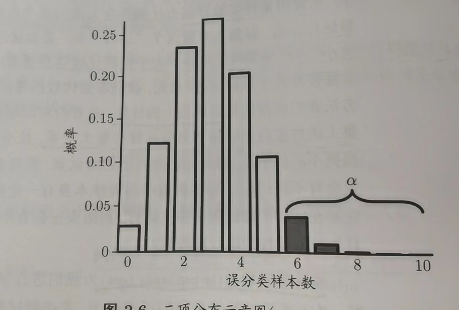
使用“二项分布”对假设$\epsilon \leq \epsilon_0$进行检验，在$1-\alpha$的概率内能观测到的最大错误率如下式计算
$$\bar \epsilon=min\hat{\epsilon} s.t. \sum_{i=\hat{\epsilon}\times m+1}^{m}\left(\begin{matrix}m\\i \end{matrix}\right)\epsilon_0^i(1-\epsilon_0)^{m-i}<\alpha
$$
若此时测试错误率$\hat{\epsilon}$大于临界值$\bar \epsilon$，则可得结论：在$\alpha$的显著度下，假设$\epsilon\leq \epsilon_0$不能被拒绝

[参考文章](https://blog.csdn.net/loyxCCS/article/details/94660689?ops_request_misc=%257B%2522request%255Fid%2522%253A%2522166720104416800186559710%2522%252C%2522scm%2522%253A%252220140713.130102334..%2522%257D&request_id=166720104416800186559710&biz_id=0&utm_medium=distribute.pc_search_result.none-task-blog-2)

很多时候多次重复留出法或是交叉验证法进行多次训练/测试，会得到多个测试错误率，可使用t-检验(t-test)
假设得到k个测试错误率，$\hat \epsilon_1,\hat \epsilon_2,\cdots, \hat \epsilon_k$，则平均测试错误率$\mu$和方差$\sigma^2$为：
$$\mu=\frac{1}{k}\sum_{i=1}^k\hat \epsilon_i\\\sigma^2=\frac{1}{k-1}\sum_{i=1}^k(\hat \epsilon_i-\mu)^2$$
这k个测试错误率可以看做泛化错误率$\epsilon_0$的独立采样，则变量$$\tau_t=\frac{\sqrt k(\mu-\epsilon_0)}{\sigma}$$
服从自由度为k-1的t分布
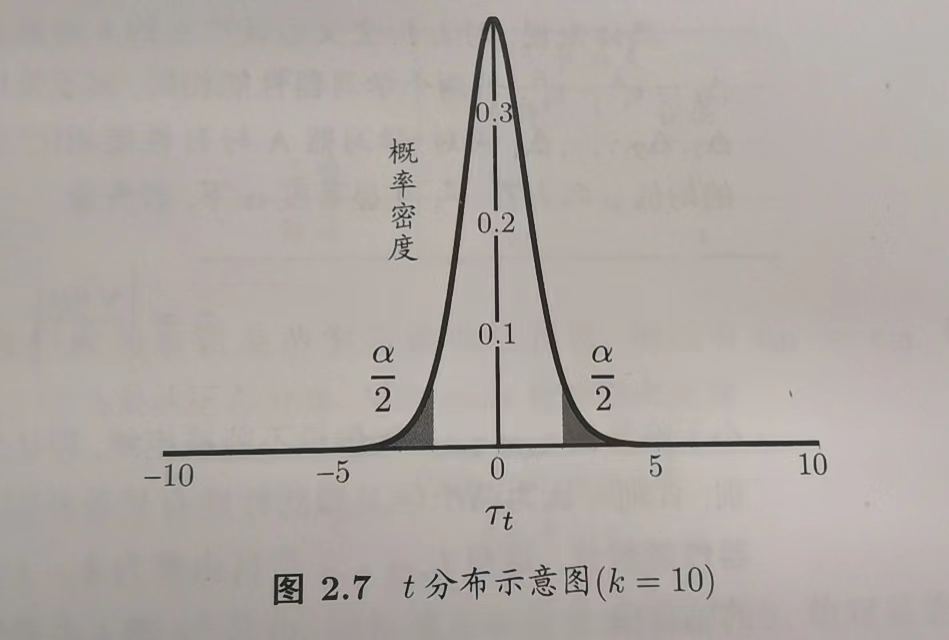
对假设$\mu=\epsilon_0$和显著度$\alpha$
考虑双边假设，若$\tau_t$落在临界值范围$[t_{-\alpha/2},t_{\alpha/2}]$内，则不能拒绝原假设
### 2.4.2交叉验证t检验：
对两个学习器A,B，使用k折交叉验证得到的测试错误率分别为$\epsilon_1^A,\epsilon_2^A,\cdots,\epsilon_k^A$和$\epsilon_1^B,\epsilon_2^B,\cdots,\epsilon_k^B$，其中$\epsilon_i^A,\epsilon_i^B$是在相同的第i折训练/测试集上得到的结果，则可使用k折交叉验证成对t检验(paired t-test)来进行比较检验，基本思想:若两个学习器性能相同，则使用相同的训练/测试集得到的测试错误率应该相同

k对测试错误率，先对每对结果求差$\Delta_i=\epsilon_i^A-\epsilon_i^B$，若两学习器性能相同，应该为0，可根据差值$\Delta_1,\Delta_2,\cdots,\Delta_k$来对学习器A与B性能相同这个假设做t检验
计算出差值均值和方差$\mu,\sigma^2$
变量：$$\tau_t=|\frac{\sqrt k\mu}{\sigma}|$$
**（单边假设）**
若小于临界值$t_{\alpha/2,k-1}$则假设不能被拒绝，即认为两个学习器的性能没有显著性差异，否则认为有显著性差异，且平均错误率较小的性能较优

实际情况：测试错误率不独立，过高估计假设成立的概率，可采用$5\times2交叉验证法$
做5次2折交叉验证，每次2折交叉验证之前随机将数据打乱，使得5次交叉验证中的数据划分不重复
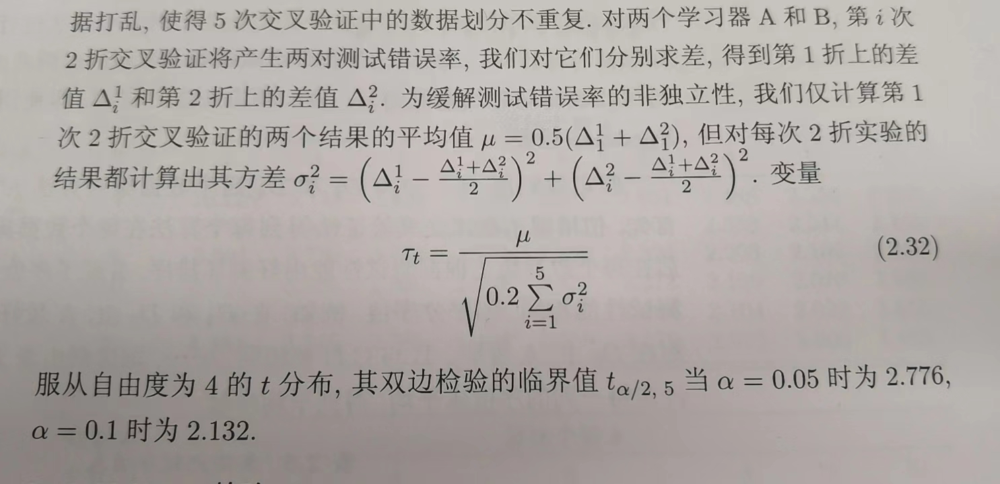

### 2.4.3 McNemar检验：
对于二分类问题

留出法不仅可以估计学习器AB的测试错误率，还可以获得分类结果的差别
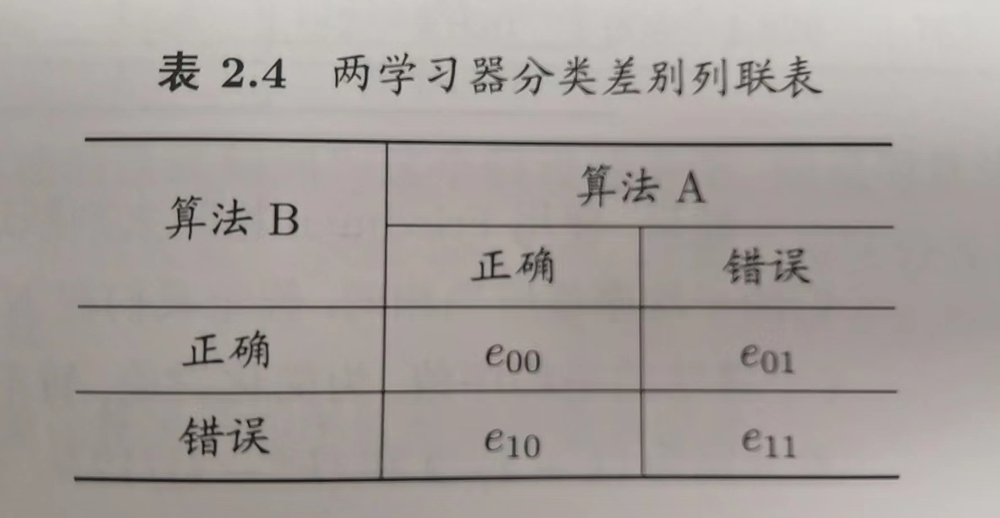
若做出的假设是两学习器性能相同，则应有$e_{01}=e_{10}$变量$|e_{01}-e_{10}|$应服从正态分布
考虑变量$$\tau_{x^2}=\frac{(|e_{01}-e_{10}|-1)^2}{e_{01}+e_{10}}$$服从自由度为1的卡方分布

### 2.4.4Friedman检验和Nemenyi后续检验
Friedman检验：
需求：在一组数据集上对多个算法进行比较
做法：根据每个数据集上测试性能由好到坏排序，得到序值，性能相同，则平分序值
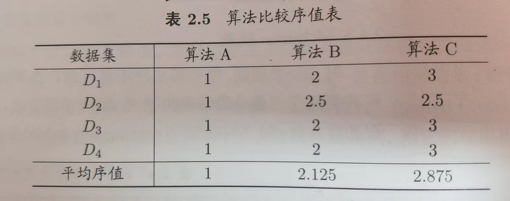
若性能相同，则平均序值应该相同
假设在N个数据集上比较k个算法，令$r_i$表示第i个算法的平均序值，则$r_i$的均值和方差为$(k+1)/2$和$(k^2-1)/12N$
变量：
$$\tau_{x^2}=\frac{12N}{k(k+1)}\left(\sum_{i=1}^kr_i^2-\frac{k(k+1)^2}{4}\right)$$在k和N都比较大的情况服从自由度为k-1的卡方分布
变量：
$$\tau_F=\frac{(N-1)\tau_X^2}{N(k-1)-\tau_X^2}$$
服从自由度为k-1和(k-1)(N-1)的F分布
## 2.5偏差与方差：
偏差方差分解(bias-variance decomposition)是解释算法泛化性能的重要工具

Nemenyi后续检验：
如果所有算法性能相同假设被拒绝，则需要进行后续检验
平均序值差别的临界值域：
$$CD=q_{\alpha}\sqrt{\frac{k(k+1)}{6N}}$$
若两算法的平均序值之差超出临界值域CD则以相应的置信度拒绝两个算法性能相同这一假设
对测试样本x，令$y_D$为x在数据集中的标记，y为x的真实标记(有可能出现噪声使$y_D\neq y$)，$f(x;D)$为训练集D上学得模型f在x上的预测输出

回归任务为例：
$$\bar f(x)=E_D[f(x;D)]$$
方差：
$$var(x)=E_D[(f(x;D)-\bar f(x))^2]$$
噪声：
$$\epsilon^2=E_D[(y_D-y)^2]$$
期望输出与真是标记的差别：
$$bias^2(x)=(\bar f(x)-y)^2$$
假定噪声期望为0
$$E(f;D)=E_D[(f(x;D)-y_D)^2]\\=bias^2(x)+var(x)+\epsilon^2$$
泛化误差可分解为偏差、方差与噪声之和

偏差：反映算法期望预期与真是结果的偏离程度，即刻画算法本身的拟合能力
方差：度量同样大小的训练集的变动所导致的学习性能的变化，即刻画数据扰动所造成的的影响
噪声：表达当前任务上任何学习算法所能达到的期望泛化误差的下界，即刻画学习问题本身的难度

偏差-方差窘境：
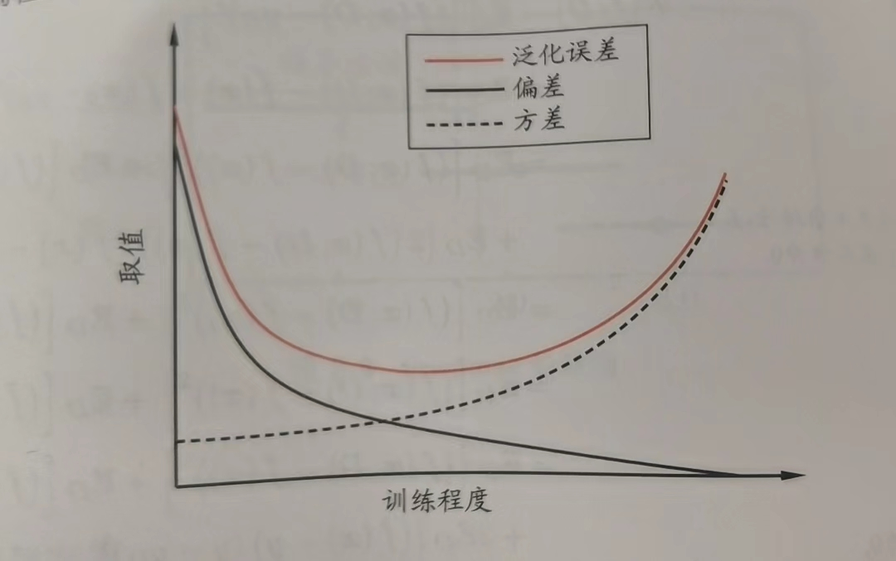
